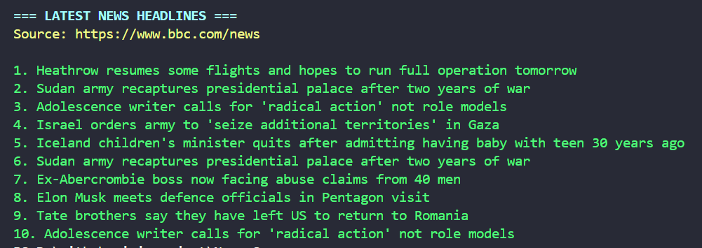

# 📰 News Headline Scraper

A Python web scraper that extracts and displays latest headlines from BBC News.



## 🌟 Features
- Fetches live webpage content
- Parses HTML using BeautifulSoup
- Filters and cleans headline text
- Error handling for network issues
- Color-coded CLI output

## 🛠️ Requirements
- Python 3.x
- `requests` and `beautifulsoup4` libraries

## 🚀 Usage
```bash
python news_scraper.py
```
## ⚙️ Installation
```bash
git clone https://github.com/Parsa-developer/news-scraper.git
cd news-scraper
pip install -r requirements.txt